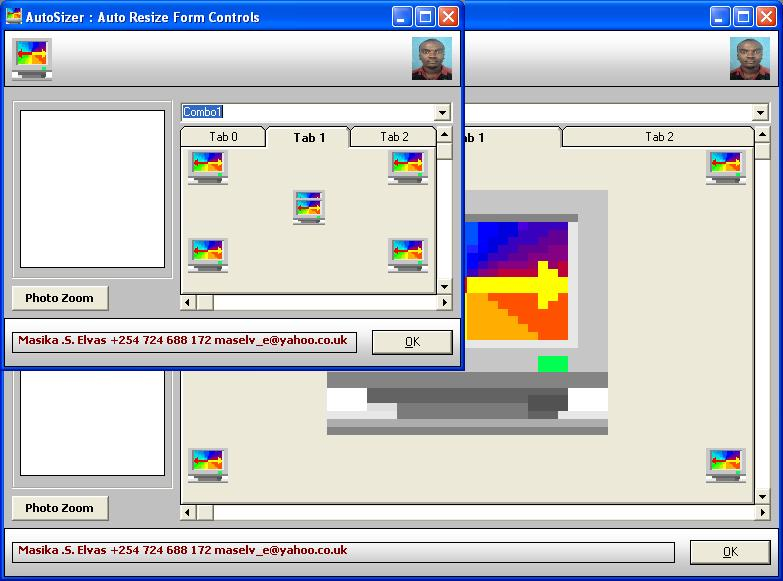



## AutoSizer

### Description

AutoSizer is an ActiveX control that adds intelligent form resizing to your applications without any code. AutoSizer provides simple proportional resizing just by adding it to your form. Unlike other resizing controls, AutoSizer additionally provides intelligent Resizing. You can individually adjust the size, position and font of each control on your form. Not case-sensitive.
 
### More Info
 

             |
---                |---
**Submitted On**   |2011-03-29 11:22:08
**By**             |[Maselv](https://github.com/Planet-Source-Code/PSCIndex/blob/master/ByAuthor/maselv.md)
**Level**          |Advanced
**User Rating**    |4.6 (32 globes from 7 users)
**Compatibility**  |VB 6\.0
**Category**       |[Graphics](https://github.com/Planet-Source-Code/PSCIndex/blob/master/ByCategory/graphics__1-46.md)
**World**          |[Visual Basic](https://github.com/Planet-Source-Code/PSCIndex/blob/master/ByWorld/visual-basic.md)
**Archive File**   |[AutoSizer2202774272011\.zip](https://github.com/Planet-Source-Code/maselv-autosizer__1-73643/archive/master.zip)

